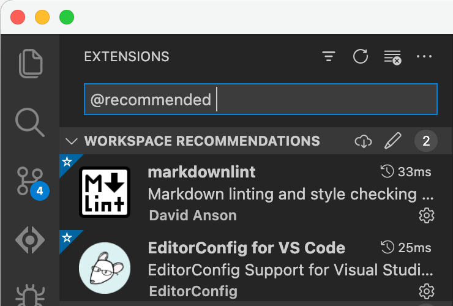

# gmailctl-recruiter-filter

A [gmailctl](https://github.com/mbrt/gmailctl) filter to auto-delete technical recruiter spam I've received over the years.

1. Despite the U.S. Goverment’s defintion of “spam” (e.g., [CAN-SPAM Act (2003)](https://www.ftc.gov/tips-advice/business-center/guidance/can-spam-act-compliance-guide-business)), my definition of spam includes _unsolicited_ email.

1. Most recruiting agencies employ a method for finding people that I refer to as a “cattle call”. They’re not reaching out to _you_; they simply found your email address associated with a keyword somewhere. And they probably confused “Java” with “JavaScript”. No thank you.

1. Just because someone sends you an email, it does not mean that you **owe** them your time or attention. You may _choose_ to give it, but you don’t _owe_ them anything. Save your brain-space for the things that matter, and turn down the noise in your inbox.

1. This definition is only a _fragment_ of a valid `gmailctl` configuration. You will need to add it to your existing configurations by-hand, with automation, or whatever level of effort you feel like applying.

## Contributing

1. PRs are welcome.

1. All variations of emails related specifically related to recruiting should be provided, if possible.

1. Don't _over_ block. For example, do not block all of `@amazon.com` or `@microsoft.com` just to block a couple of recruiters. Use their direct email addresses instead.

1. Lint your Markdown changes with [DavidAnson/markdownlint](https://github.com/DavidAnson/markdownlint).

1. Follow the [EditorConfig](https://editorconfig.org) definition for formatting files.

1. If you use [VS Code](https://code.visualstudio.com), install the recommended extensions to do the linting/formatting automatically.

    
